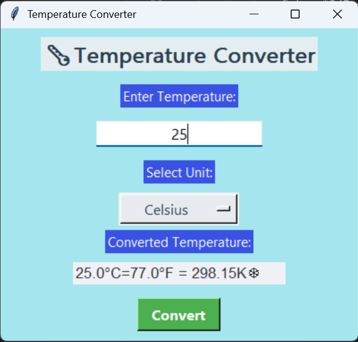

#  Temperature Converter GUI

This is a Python GUI project that converts temperatures between **Celsius, Fahrenheit, and Kelvin** using the Tkinter library.

>  Built as part of my internship at **Prodigy Infotech** – Task 01 (Software Development Track)

---

##  Features

- 🔁 Converts between Celsius, Fahrenheit, and Kelvin
- 🖥️ Beautiful and beginner-friendly GUI using Tkinter
- 🎨 Clean layout with labels, dropdowns, and result display
- ✅ Real-time output on button click

---

## Tech Stack

- `Python`
- `Tkinter (for GUI)`

---

##  Screenshot



---

##  Developed By

**Vaishnavi Lalan**  
Aspiring Developer | Beginner Coder | Problem Solver   
[LinkedIn](https://linkedin.com/in/vaishnavi-lalan/) | [GitHub](https://github.com/VaishnaviLalan106)

---

##  Folder Structure
```
temperature_converter/
├── temp_converter.py         # Main Python GUI file
├── screenshot.jpg            # Screenshot of the app
└── README.md                 # Project description
```


